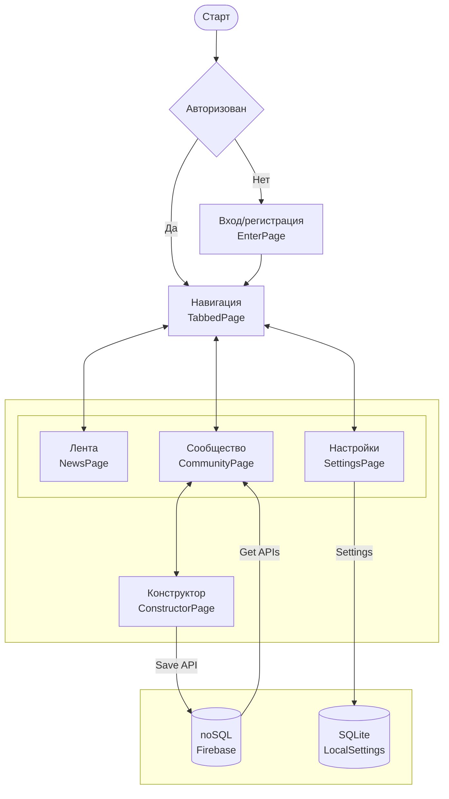

# Кроссплатформенный новостной агрегатор с конструктором API

---

## О проекте

**NewsAggregator (Gazebo Apps)** — это мобильное приложение для агрегации новостей, разработанное на платформе **Microsoft Xamarin** (позже перенесён на **.NET MAUI**). Проект поддерживает три основные операционные системы: **iOS**, **Android** и **UWP**.

Приложение позволяет пользователям получать актуальные новости из различных интернет-источников, сортировать их по категориям и дате, а также **добавлять собственные новостные сайты** через встроенный конструктор API — без участия разработчика.

---

## Возможности приложения

| Модуль | Описание |
| :--- | :--- |
| **Новостная лента** | Получение и отображение статей из выбранных источников. Поддерживаются фильтрация по разделам и сортировка по времени. |
| **Парсер (AngleSharp)** | Анализ веб-ресурсов|
| **Конструктор API** | Пользовательский интерфейс для добавления собственных источников: указание URL, CSS-селекторов для заголовков, изображений и текста, отладка и публикация. |
| **Сообщество** | Просмотр API, созданных другими пользователями, поиск, добавление источников в свою ленту. |
| **Личные настройки** | Управление списком ресурсов, хранение настроек отображения и авторизация. |

---

## Технологический стек

### Платформа разработки
- **Microsoft Xamarin.Forms** — кроссплатформенная разработка под iOS, Android, UWP на единой кодовой базе C#

### Backend
- **C# (.NET Standard)**
- **SQLite** — локальная СУБД для хранения пользовательских настроек
- **Firebase Realtime Database** — облачное хранение созданных пользователями API
- **Firebase Authentication**

### Парсинг веб-ресурсов
- **AngleSharp** — библиотека с открытым исходным кодом для анализа HTML и построения DOM-дерева

### Frontend
- **XAML** — язык разметки интерфейса
- **Figma** — проектирование UX/UI макетов до начала верстки

### Отладка
- **Xcode 14**

---

## Структура приложения

---
## Сравнение

| **Функция** | **Приложение аналог** |
| :--- | :--- |
| **Самостоятельное составление ленты** | "NewsWorm" |
| **Конструктор API (возможность добавлять свои интернет-ресурсы)** | — |
| **Новостная лента с фильтрами по разделам и сортировкой** | "Яндекс.Дзен", "Google.Новости", "РБК", "Pocket" |
| **Межпользовательское взаимодействие (возможность делиться любимыми ресурсами)** | "Pocket" |

---

## Интерфейс

#### Авторизация

| Вход | Создание аккаунта |
| :---: | :---: |
|  |  |

#### Основные экраны

| Лента новостей | Сообщество | Настройки |
| :---: | :---: | :---: |
|  |  |  |

#### Конструктор API

| Список ресурсов | Конструктор (сообщество) |
| :---: | :---: |
|  |  |

## Статус проекта

**Проект завершён в 2024 году в рамках олимпиадной работы (Шаг в будущее).**

---
© 2024 Глущенко Дмитрий
